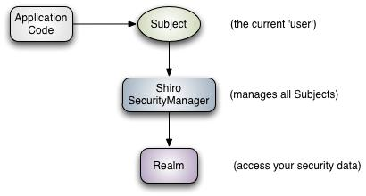

Apache Shiro是一个功能强大且易于使用的Java安全框架，可以帮助我们完成身份验证，授权，加密和会话管理等功能

- Authentication：身份认证/登录，验证用户是否合法；
- Authorization：授权，即权限验证，验证某个已认证的用户是否拥有某个角色或者权限；
- Session Manager：会话管理，即用户登录后就是一次会话，在没有退出之前，它的所有信息都在会话中；
- Cryptography：加密，保护数据的安全性，如密码加密存储到数据库，而不是明文存储；
- Web Support：Web 支持，可以非常容易的集成到 Web 环境；
- Caching：缓存，比如用户登录后，其用户信息、拥有的角色/权限不必每次去查，这样可以提高效率；
- Concurrency：shiro 支持多线程应用的并发验证，即如在一个线程中开启另一个线程，能把权限自动传播过去；
- Testing：提供测试支持；
- Run As：允许一个用户假装为另一个用户（如果他们允许）的身份进行访问；
- Remember Me：记住我，这个是非常常见的功能，即一次登录后，下次再来的话不用登录了。

Shiro 不会去维护用户、维护权限；这些需要我们自己去设计/提供；然后通过相应的接口注入给Shiro即可

### 从应用程序角度观察如何使用 Shiro 完成工作

- Subject：主体，代表了当前“用户”，可以是人，网络爬虫，机器人等；即一个抽象概念；
所有 Subject 都绑定到 SecurityManager，与 Subject的所有交互都会委托给SecurityManager；

- SecurityManager ：安全管理器；即所有与安全有关的操作都会与 SecurityManager 交互；且它管理着所有 Subject；
可以看出它是 Shiro 的核心，它负责与后边介绍的其他组件进行交互；

- Realm：Shiro从 Realm 获取安全数据（如用户、角色、权限），就是说 SecurityManager要验证用户身份，
那么它需要从 Realm 获取相应的用户进行比较以确定用户身份是否合法；也需要从 Realm 得到用户相应的
角色/权限进行验证用户是否能进行操作；可以把 Realm 看成 DataSource，即安全数据源。

Shiro不提供维护用户 / 权限,而是通过Realm让开发人员自己注入

### 从 Shiro 内部来看 Shiro 的架构

- Subject：主体，可以看到主体可以是任何可以与应用交互的“用户”；

- SecurityManager ：是 Shiro 的心脏；所有具体的交互都通过 SecurityManager 进行控制；
它管理着所有 Subject、且负责进行认证和授权、及会话、缓存的管理。

- Authenticator：认证器，负责主体认证的，这是一个扩展点，如果用户觉得 Shiro 默认的不好，
可以自定义实现；其需要认证策略（Authentication Strategy），即什么情况下算用户认证通过了；

- Authrizer：授权器，用来决定主体是否有权限进行相应的操作；即控制着用户能访问应用中的哪些功能；

- Realm ：可以有1个或多个Realm，可以认为是安全实体数据源，即用于获取安全实体的；
可以是JDBC 实现，也可以是LDAP 实现，或者内存实现等等；由用户提供；
注意：Shiro不知道你的用户/权限存储在哪及以何种格式存储；所以我们一般在应用中都需要实现自己的 Realm；

- SessionManager：Shiro 不仅仅可以用在 Web 环境，也可以用在如普通的 JavaSE 环境、EJB 等环境；
所以Shiro 就抽象了一个自己的 Session来管理主体与应用之间交互的数据；

- SessionDAO：用于会话的 CRUD，比如我们想把 Session保存到数据库，那么可以实现自己的 SessionDAO，
通过如 JDBC 写到数据库；另外 SessionDAO中可以使用 Cache 进行缓存，以提高性能；

- CacheManager：缓存控制器，来管理如用户、角色、权限等的缓存的；因为这些数据基本上很少去改变，
放到缓存中后可以提高访问的性能

- Cryptography ：密码模块，Shiro 提高了一些常见的加密组件用于如密码加密/解密。

### 身份认证
身份验证，验证用户的身份在系统中是否存在。在 shiro 中，用户需要提供 principals （身份）
和 credentials（证明）给 shiro，从而应用能验证用户身份：

- principals：身份，即主体的标识属性，可以是任何东西，如用户名、邮箱等，唯一即可。
一个主体可以有多个 principals，但只有一个 Primary principals，一般是用户名/邮箱/手机号。

- credentials：证明/凭证，即只有主体知道的安全值，如密码/数字证书等。

最常见的 principals 和 credentials 组合就是用户名/密码了。

### Shiro提供的Relam

以后一般继承 AuthorizingRealm（授权）即可；其继承了 AuthenticatingRealm（即身份验证），而且也间接继承了 CachingRealm（带有缓存实现）
- IniRealm：[users]部分指定用户名/密码及其角色；[roles]部分指定角色即权限信息；
- PropertiesRealm：user.username=password,role1,role2 指定用户名/密码及其角色；role.role1=permission1,permission2 指定角色及权限信息；
- JdbcRealm：通过 sql 查询相应的信息

### Authenticator 及 AuthenticationStrategy
Authenticator 的职责是验证用户帐号，是 Shiro API 中身份验证核心的入口点

SecurityManager 接口继承了 Authenticator，另外还有一个 ModularRealmAuthenticator 实现，其委托给多个 Realm 进行验证，
验证规则通过 AuthenticationStrategy 接口指定，默认提供的实现：

- FirstSuccessfulStrategy：只要有一个 Realm 验证成功即可，只返回第一个 Realm 身份验证成功的认证信息，其他的忽略；
- AtLeastOneSuccessfulStrategy：只要有一个 Realm 验证成功即可，和 FirstSuccessfulStrategy不同，返回所有 Realm 身份验证成功的认证信息；
- AllSuccessfulStrategy：所有 Realm 验证成功才算成功，且返回所有 Realm 身份验证成功的认证信息，如果有一个失败就失败了。

ModularRealmAuthenticator 默认使用 AtLeastOneSuccessfulStrategy 策略。

### 代码说明：
1. 基本认证：代码参考【chapter01.AuthenticationTest】
2. 单个realm，代码参考【chapter01.CustomRealmTest】
3. 多个realm，代码参考【chapter01.CustomMulRealmTest】
4. JdbcRealm使用，需要先执行sql建表，代码参考【chapter01.JDBCRealmTest】
5. 验证AuthenticationStrategy，代码参考【chapter01.AuthenticatorTest】