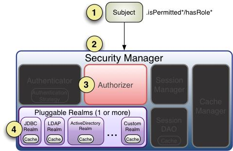

授权，也叫访问控制，即在应用中控制谁能访问哪些资源（如访问页面/编辑数据/页面操作等）。
在授权中需了解的几个关键对象：主体（Subject）、资源（Resource）、权限（Permission）、角色（Role）。

1. 主体，即访问应用的用户，在 Shiro 中使用 Subject 代表该用户。
2. 资源，在应用中用户可以访问的任何东西，比如访问 JSP 页面、查看/编辑某些数据
3. 权限，表示在应用中用户能不能访问某个资源

Shiro 支持三种方式的授权：
1. 编程式：通过写 if/else 授权代码块完成;
2. 注解式：通过在执行的 Java 方法上放置相应的注解完成：没有权限将抛出相应的异常；
3. JSP标签：在 JSP页面通过相应的标签完成;

### 字符串通配符权限
规则：“资源标识符：操作：对象实例ID” 即对哪个资源的哪个实例可以进行什么操作。

其默认支持通配符权限字符串，“:”表示资源/操作/实例的分割；“,”表示操作的分割；“*”表示任意资源/操作/实例。

比如用户拥有资源“system:user”的“create”、“update”、“delete”和“view”所有权限。可以简写成：system:user:*或者system:user

所有资源的全部权限，比如*:view，表示用户拥有所有资源的“view”所有权限。
假设判断的权限是“system:user:view”，那么需要“role5=*:*:view”这样写才行。

### 授权流程

1. 当我们调用 Subject.isPermitted*/hasRole*接口，其会委托给 SecurityManager，而SecurityManager 接着会委托给 Authorizer；
2. Authorizer 是真正的授权者，如果我们调用如 isPermitted(“user:view”)，其首先会通过PermissionResolver 把字符串转换成相应的 Permission 实例；
3. 在进行授权之前，其会调用相应的 Realm 获取 Subject 相应的角色/权限用于匹配传入的角色/权限；
4. Authorizer 会判断 Realm 的角色/权限是否和传入的匹配，如果有多个 Realm，会委托给ModularRealmAuthorizer 进行循环判断，
    如果匹配如 isPermitted*/hasRole*会返回 true，否则返回 false 表示授权失败。

ModularRealmAuthorizer 进行多 Realm 匹配流程：
1. 首先检查相应的 Realm 是否实现了Authorizer；
2. 如果实现了 Authorizer，那么接着调用其相应的 isPermitted*/hasRole*接口进行匹配；
3. 如果有一个 Realm 匹配那么将返回 true，否则返回 false。

如果 Realm 进行授权的话，应该继承 AuthorizingRealm，其流程是：
1. 如果调用 hasRole*，则直接获取 AuthorizationInfo.getRoles()与传入的角色比较即可；
2. 首先如果调用如 isPermitted(“user:view”)，首先通过 PermissionResolver 将权限字符串转换成相应的 Permission 实例，
     默认使用 WildcardPermissionResolver，即转换为通配符的WildcardPermission；
3. 通过 AuthorizationInfo.getObjectPermissions() 得到 Permission 实例集合 ； 通过AuthorizationInfo.getStringPermissions()
    得到字符串集合并通过 PermissionResolver 解析为Permission 实例；然后获取用户的角色，并通过 RolePermissionResolver 解析
    角色对应的权限集合（默认没有实现，可以自己提供）；
4. 接着调用 Permission.implies(Permission p)逐个与传入的权限比较，如果有匹配的则返回true，否则 false。

###  ini配置
```
[main]
#提供了对根对象 securityManager 及其依赖的配置
securityManager=org.apache.shiro.mgt.DefaultSecurityManager
…………
securityManager.realms=$jdbcRealm
[users]
#提供了对用户/密码及其角色的配置，用户名=密码，角色 1，角色 2
username=password,role1,role2
[roles]
#提供了角色及权限之间关系的配置，角色=权限 1，权限 2
role1=permission1,permission2
[urls]
#用于 web，提供了对 web url 拦截相关的配置，url=拦截器[参数]，拦截器
/index.html = anon
/admin/** = authc, roles[admin], perms["permission1"]
```
