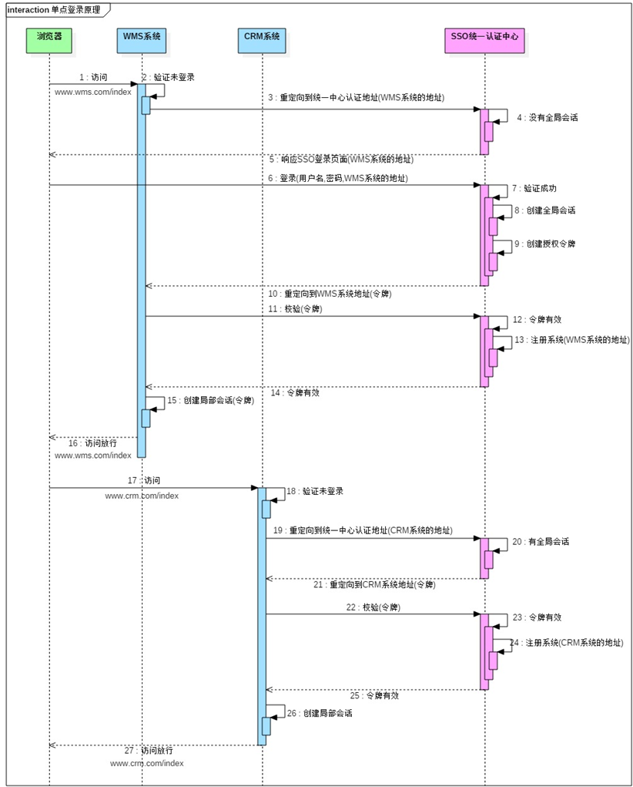

### 传统登录方式
1. 用户输入用户名和密码，提交到服务器
2. 服务器根据用户名从数据库中获取相应的密码进行比对，成功后把用户信息存入session，
    比如req.getSession().setAttribute("USER_IN_SESSION",currentUser);
3. 用户请求数据时默认都会带上JSESSIONID，在过滤器中校验，
    req.getSession().setAttribute("USER_IN_SESSION")是否为null，不为null表示已登录，可以访问。

### 单点登录
随着公司业务做大，系统越来越多，每个系统都要登录一遍，对于用户来说很麻烦，有没有可能只需要
登录一次,公司里面所有的系统都可以使用.只需要注销一次,所有的系统都退出登录了？当然有，单点登录就是解决这个问题的。

### 什么是单点登录
什么是单点登录？单点登录全称Single Sign On（以下简称SSO），是指在多系统应用群中登录一个系统，
便可在其他所有系统中得到授权而无需再次登录，包括单点登录与单点注销两部分.

这里以www.wms.com、www.crm.com、www.sso.com域名分别表示wms，crm系统和统一认证中心。如下图所示：


具体交互方式：
1. 用户访问www.wms.com/index，wms系统发现未登录，然后跳转到www.sso.com?clientUrl=www.wms.com/index
2. sso系统发现没有全局会话，跳转到sso的登录页面，用户输入用户名和密码之后提交登录。
3. 验证成功后创建全局会话，创建授权令牌(token)。重定向到www.wms.com/index?token=授权令牌。
4. wms在服务端再次发起一个请求用于校验令牌(token)是否有效，sso验证如果有效，则把wms注册到sso系统。
5. 创建局部会话，www.wms.com/index访问放行

6. 过一会儿后，用户访问www.crm.com/index,crm系统发现未登录，然后跳转到www.sso.com?clientUrl=www.crm.com/index
7. sso系统发现有全局会话，重定向到www.crm.com/index?token=授权令牌。
8. crm在服务端再次发起一个请求用于校验令牌(token)是否有效，sso验证如果有效，则把crm注册到sso系统。
9. 创建局部会话，www.crm.com/index访问放行

### 具体实现
为了测试实现跨域的单点登录，修改C:\Windows\System32\drivers\etc\hosts文件,添加如下配置:
```
127.0.0.1 www.sso.com
127.0.0.1 www.crm.com
127.0.0.1 www.wms.com
```
这样我们就可以在本机直接使用www.sso.com来访问了。

1. crm和wms系统具体实现

1.1 拦截客户端的请求判断是否有局部的session，如果有局部的session,放行请求，如果没有局部session
1.2 请求中是否携带token参数，没有则重定向到统一认证中心页面进行登陆，如果有,使用HttpURLConnection发送请求校验token是否有效.
1.3 如果token有效,建立局部的session，如果token无效,重定向到统一认证中心页面进行登陆.
```java
package cn.wolfcode.sso.filter;

import java.io.IOException;
import java.util.HashMap;
import java.util.Map;

import javax.servlet.Filter;
import javax.servlet.FilterChain;
import javax.servlet.FilterConfig;
import javax.servlet.ServletException;
import javax.servlet.ServletRequest;
import javax.servlet.ServletResponse;
import javax.servlet.http.HttpServletRequest;
import javax.servlet.http.HttpServletResponse;
import javax.servlet.http.HttpSession;

import org.apache.commons.lang3.StringUtils;

import cn.wolfcode.sso.util.HttpUtil;
import cn.wolfcode.sso.util.SSOClientUtil;

public class SSOClientFilter implements Filter {

	@Override
	public void init(FilterConfig filterConfig) throws ServletException {

	}

	@Override
	public void doFilter(ServletRequest request, ServletResponse response,
			FilterChain chain) throws IOException, ServletException {
		HttpServletRequest req = (HttpServletRequest) request;
		HttpServletResponse resp = (HttpServletResponse) response;
		HttpSession session = req.getSession();
		//1.判断是否有局部的会话
		Boolean isLogin = (Boolean) session.getAttribute("isLogin");
		if(isLogin!=null && isLogin){
			//有局部会话,直接放行.
			chain.doFilter(request, response);
			return;
		}
		//判断地址栏中是否有携带token参数.
		String token = req.getParameter("token");
		if(StringUtils.isNoneBlank(token)){
			//token信息不为null,说明地址中包含了token,拥有令牌.
			//判断token信息是否由认证中心产生的.
			String httpURL = SSOClientUtil.SERVER_URL_PREFIX+"/verify";
			Map<String,String> params = new HashMap<String,String>();
			params.put("token", token);
			params.put("clientUrl", SSOClientUtil.getClientLogOutUrl());
			params.put("jsessionid", session.getId());
			try {
				String isVerify = HttpUtil.sendHttpRequest(httpURL, params);
				if("true".equals(isVerify)){
					//如果返回的字符串是true,说明这个token是由统一认证中心产生的.
					//创建局部的会话.
					session.setAttribute("isLogin", true);
					//放行该次的请求
					chain.doFilter(request, response);
					return;
				}
			} catch (Exception e) {
				e.printStackTrace();
			}
		}
		//没有局部会话,重定向到统一认证中心,检查是否有其他的系统已经登录过.
		// http://www.sso.com:8443/checkLogin?redirectUrl=http://www.crm.com:8088
		SSOClientUtil.redirectToSSOURL(req, resp);
	}

	@Override
	public void destroy() {

	}

}

```

2. sso授权中心具体实现

2.1 检测客户端在SSO授权中心是否已经登录了.(checkLogin方法)
	获取session中的token，如果token不为空,说明服务端已经登录过了,此时重定向到客户端的地址,并把token带上；
	如果token为空,跳转到统一认证中心的的登录页面,并把redirectUrl放入到request域中。
```java
    @RequestMapping("/checkLogin")
    public String checkLogin(String redirectUrl, HttpSession session,Model model){
        //1.判断是否有全局的会话
        String token = (String) session.getAttribute("token");
        if(StringUtils.isEmpty(token)){
            //表示没有全局会话
            //跳转到统一认证中心的登陆页面.
            model.addAttribute("redirectUrl",redirectUrl);
            return "login";
        }else{
            //有全局会话
            //取出令牌信息,重定向到redirectUrl,把令牌带上  http://www.wms.com:8089/main?token
            model.addAttribute("token",token);
            return "redirect:"+redirectUrl;
        }
    }
```

2.2 统一认证中心的登录方法(login方法)

判断用户提交的账号密码是否正确。如果错误转发到login.jsp,还需要把redirectUrl参数放入到request域中，否则：
- 创建token(可以使用UUID,保证唯一就可以)
- 把token放入到session中.
- 这个token要知道有哪些客户端登陆了,创建Map<String,List<String[]> clientMap;(为单点注销做准备)
- 转发到redirectUrl地址,把token带上.
```java
    @RequestMapping("/login")
    public String login(String username,String password,String redirectUrl,HttpSession session,Model model){
        if("zhangsan".equals(username)&&"666".equals(password)){
            //账号密码匹配
            //1.创建令牌信息
            String token = UUID.randomUUID().toString();
            //2.创建全局的会话,把令牌信息放入会话中.
            session.setAttribute("token",token);
            //3.需要把令牌信息放到数据库中.
            MockDatabaseUtil.T_TOKEN.add(token);
            //4.重定向到redirectUrl,把令牌信息带上.  http://www.crm.com:8088/main?token=
            model.addAttribute("token",token);
            return "redirect:"+redirectUrl;
        }
        //如果账号密码有误,重新回到登录页面,还需要把redirectUrl放入request域中.
        model.addAttribute("redirectUrl",redirectUrl);
        return "login";
    }
```

3. 统一认证中心认证token方法(verify方法)

3.1 如果MockDatabaseUtil.T_TOKEN.contains(token)有数据,说明token是有效的.
	把客户端传入的客户端登出地址(clientLogOutUrl)和会话ID(jsessionid)保存到集合中.
    如果SSOUtil.clientMap.get(token)为null,说明token是无效的,返回false字符串.
```java
    @RequestMapping("/verify")
    @ResponseBody
    public String verifyToken(String token,String clientUrl,String jsessionid){
        if(MockDatabaseUtil.T_TOKEN.contains(token)){
            //把客户端的登出地址记录
            List<ClientInfoVo> clientInfoList = MockDatabaseUtil.T_CLIENT_INFO.get(token);
            if(clientInfoList==null){
                clientInfoList = new ArrayList<ClientInfoVo>();
                MockDatabaseUtil.T_CLIENT_INFO.put(token,clientInfoList);
            }
            ClientInfoVo vo = new ClientInfoVo();
            vo.setClientUrl(clientUrl);
            vo.setJsessionid(jsessionid);
            clientInfoList.add(vo);
            //说明令牌有效,返回true
            return "true";
        }
        return "false";
    }
```
### 单点注销
1. 客户端需要自己实现登出方法，以供sso调用，并且客户端的登出按钮都是调用的是sso的登出方法
```java
@WebServlet(name = "LogOutServlet.java", urlPatterns = "/logOut")
public class LogOutServlet extends HttpServlet {
	@Override
    protected void doGet(HttpServletRequest req, HttpServletResponse resp) throws ServletException, IOException {
		doPost(req, resp);
    }
	@Override
	protected void doPost(HttpServletRequest req, HttpServletResponse resp)
			throws ServletException, IOException {
		req.getSession().invalidate();
	}
}
```
2. 服务端编写logOut方法,调用session.invalidate()
2.1 创建session的监听器,在session的监听器的销毁方法写如下逻辑
    - 获取session中的token.
    - 根据token在SSOUtil.clientMap获取所有客户端的登出地址和会话id
    - 通过HttpUtil选项调用客户端的登出方法.
    - 将session监听器注册到web.xml中.
```java
    @RequestMapping("/logOut")
    public String logOut(HttpSession session){
        //销毁全局会话
        session.invalidate();
        return "logOut";
    }
    
    public class MySessionListener implements HttpSessionListener {
        @Override
        public void sessionCreated(HttpSessionEvent se) {
    
        }
    
        @Override
        public void sessionDestroyed(HttpSessionEvent se) {
            HttpSession session = se.getSession();
            String token = (String) session.getAttribute("token");
            //删除t_token表中的数据
            MockDatabaseUtil.T_TOKEN.remove(token);
            List<ClientInfoVo> clientInfoVoList = MockDatabaseUtil.T_CLIENT_INFO.remove(token);
            try{
                for(ClientInfoVo vo:clientInfoVoList){
                    //获取出注册的子系统,依次调用子系统的登出的方法
                    HttpUtil.sendHttpRequest(vo.getClientUrl(),vo.getJsessionid());
                }
            }catch(Exception e){
                e.printStackTrace();
            }
        }
    }

```
本文内容来自：http://www.wolfcode.cn/portal/ChooseCourses/info?id=20

